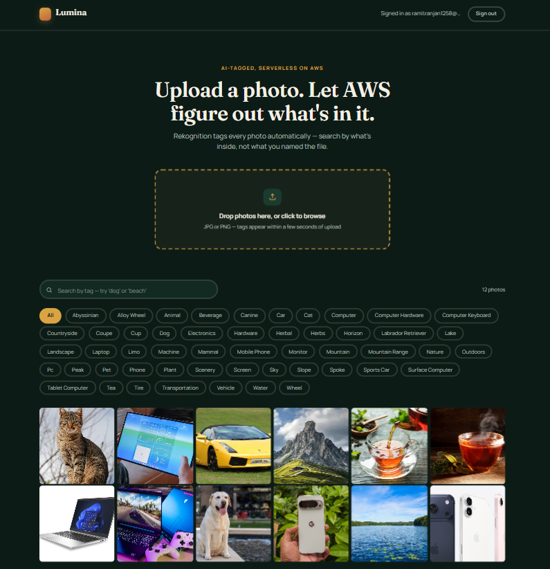
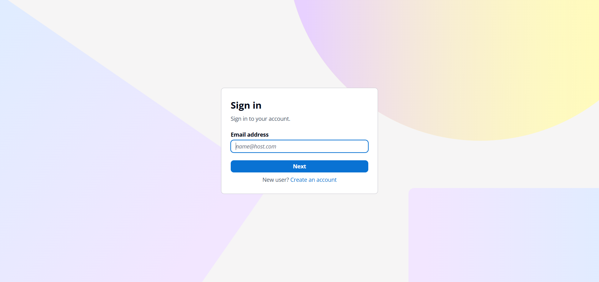
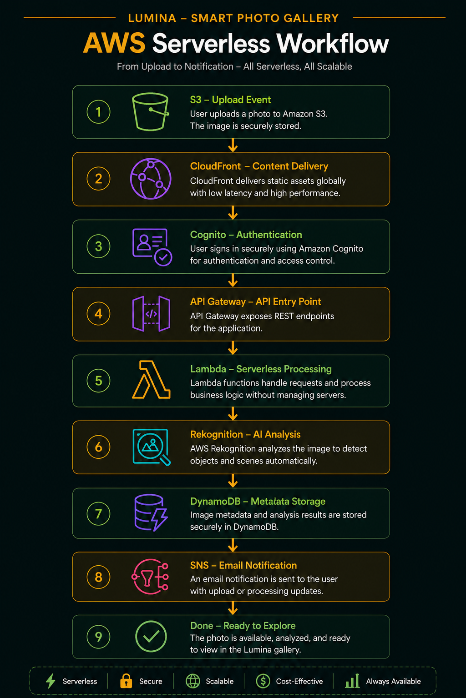
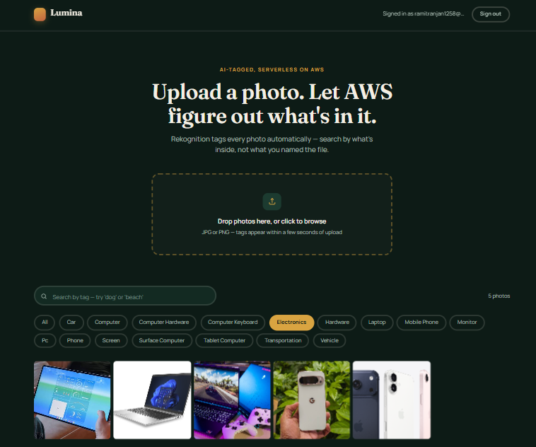

# 📸 Lumina – Smart Photo Gallery

A cloud-native, serverless Smart Photo Gallery built on AWS that enables users to securely upload, organize, and search photos using AI-powered image recognition.

---

## 🚀 Features

- 🔐 User authentication with AWS Cognito
- 📤 Secure image uploads using S3 Pre-signed URLs
- 🤖 Automatic image tagging with AWS Rekognition
- 🔍 Search photos using AI-generated tags
- ⚡ Serverless REST APIs powered by AWS Lambda & API Gateway
- 🗄️ Metadata storage with DynamoDB
- ☁️ Fast content delivery using CloudFront
- 📊 Monitoring and logging with CloudWatch

---

## 🏗️ Architecture

```
User
   │
   ▼
CloudFront
   │
   ▼
Static Website (HTML/CSS/JavaScript)
   │
   ▼
AWS Cognito (Authentication)
   │
   ▼
API Gateway
   │
   ▼
AWS Lambda
   │
   ├──────────────► Amazon S3
   │                    │
   │                    ▼
   │             Object Created Event
   │                    │
   ▼                    ▼
Amazon Rekognition ───► DynamoDB
           │
           ▼
      Amazon SNS
```

---

## 🛠️ AWS Services Used

- Amazon S3
- AWS Lambda
- Amazon API Gateway
- Amazon Cognito
- Amazon DynamoDB
- Amazon Rekognition
- Amazon SNS
- Amazon CloudFront
- Amazon CloudWatch
- AWS IAM

---

## 💻 Technologies Used

- HTML5
- CSS3
- JavaScript (ES6)
- AWS Serverless Services

---

## 📸 Project Screenshots

### Dashboard



### Cognito Sign-In



### AWS Serverless Architecture



### AI Search Results



---

## ⚙️ Configuration

Before running the project, replace the placeholders inside **index.html**.

```javascript
const API_BASE = "YOUR_API_GATEWAY_URL";

const COGNITO_DOMAIN = "YOUR_COGNITO_DOMAIN";

const COGNITO_CLIENT_ID = "YOUR_COGNITO_CLIENT_ID";

const REDIRECT_URI = "YOUR_CLOUDFRONT_URL";
```

---

## ▶️ Running the Project

1. Configure the AWS resources listed above.
2. Replace the placeholder values in `index.html`.
3. Open `index.html` in your browser or deploy it using Amazon S3 + CloudFront.
4. Sign in with AWS Cognito.
5. Upload images and search them using AI-generated tags.

---

## 📚 What I Learned

- Building end-to-end serverless applications on AWS
- Implementing secure authentication using Cognito
- Generating S3 Pre-signed URLs
- Designing REST APIs with API Gateway and Lambda
- Integrating Amazon Rekognition for AI-based image tagging
- Managing image metadata with DynamoDB
- Monitoring applications using CloudWatch
- Configuring IAM permissions and CORS

---

## 📌 Note

This repository contains the frontend source code only.

Sensitive AWS configuration values (API Gateway URL, Cognito Domain, Client ID, CloudFront URL, etc.) have been replaced with placeholders for security reasons.

---

## 👨‍💻 Author

**Ramit Ranjan**

- GitHub: https://github.com/ramit-ranjan/Lumina-Smart-Photo-Gallery
- LinkedIn: https://www.linkedin.com/in/ramit-ranjan-959021293/

---

## ⭐ Support

If you found this project helpful, consider giving it a ⭐ on GitHub.
